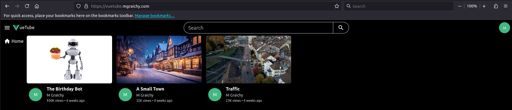
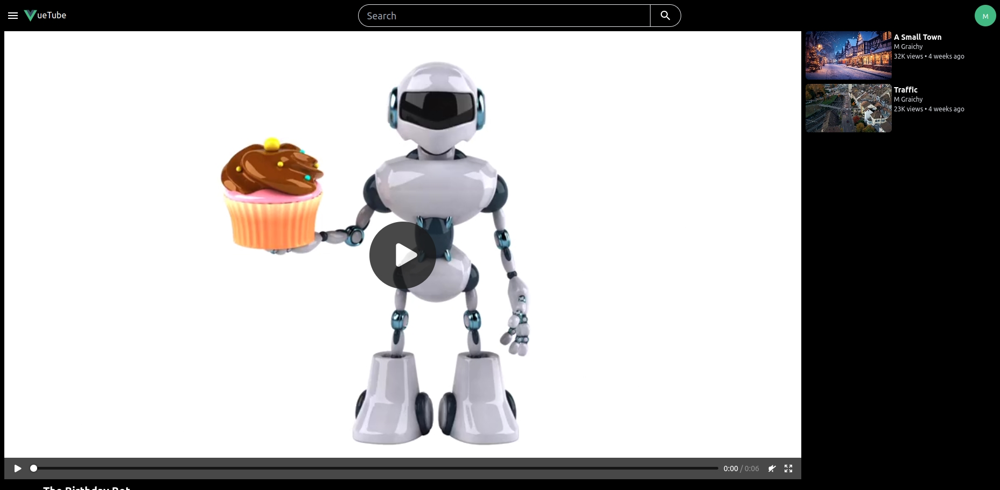

# VueTube

VueTube is a YouTube-inspired application built with a Vue 3 frontend and a Laravel 11 backend, designed to operate with completely separate frontend and backend domains. It features full OAuth2.0 authentication and serves videos from a private server-side directory for enhanced security.

This is the frontend. [The backend is here](https://github.com/mgraichy/laravel-auth).

---

## Features

- **Vue 3 Frontend**: Built with the Composition API for a modern and reactive user experience.
- **Service Workers**: Implemented for robust caching.

### Prerequisites

- Node.js (for Vue 3 frontend).
- PHP 8.2+ and Composer (for Laravel backend).
- An SQL database (MySQL, PostgreSQL, etc.).

### Live Site

The live site is fully responsive. It is on a subdomain here, however it works with fully separate domains (for e.g., a whitelabel). It features complete OAuth2.0 security.

- **Home Page**:

    

- **Individual Video Page**:

    

## License

This project is licensed under [MIT](https://opensource.org/license/mit). See the LICENSE file for details.

## Acknowledgments

The frontend was built with Vue 3, a powerful and flexible JS framework for modern web development. I drew inspiration from these two people:

- [WebDevSimplified](https://github.com/WebDevSimplified/youtube-react-ts-tailwind-home-page)
- [John Weeks](https://github.com/John-Weeks-Dev/youtube-clone)

